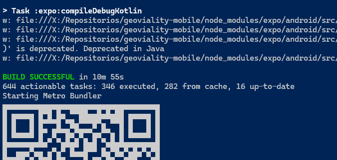
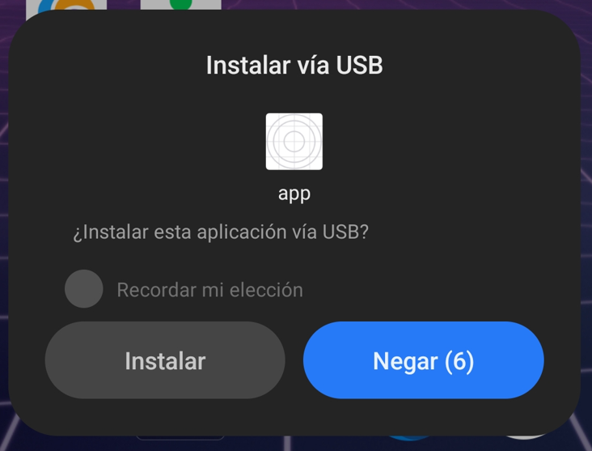
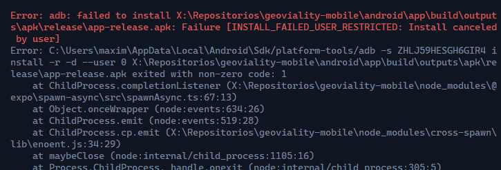

# geoviality-mobile

## Consideraciones previas

El proyecto fue desarrollado y compilado usando **Windows 11**, junto con un telefono **Android 13**. Las herramientas utilizadas estan a continuacion.

## Dependencias

- [Node.js 20.17.0 LTS](https://github.com/coreybutler/nvm-windows)
- [Expo Go](https://expo.dev/go) (instalado en el celular)
- [Android Studio](https://developer.android.com/studio) (Se debe instalar Android SDK)
- [Java 17](https://learn.microsoft.com/es-es/java/openjdk/download#openjdk-17)

## Configuración

Se espera un archivo `.env` en la raiz del proyecto con las siguientes variables:

```env
EXPO_PUBLIC_NGROK_DOMAIN="XXX.ngrok-free.app"
EXPO_PUBLIC_VERSION="0.0.1.3"
```

- `EXPO_PUBLIC_NGROK_DOMAIN` se utiliza para configurar el dominio de ngrok que se utiliza para la conexión con el backend. **Se debe ingresar unicamente el dominio, sin el `https://`.**

- `EXPO_PUBLIC_VERSION` simplemente es un string que se utiliza en la pagina principal para indicar la version y diferenciar de otras compilaciones.

## Inicio de desarrollo

1. Instalar modulos

```bash
npm install
```

2. Correr la app **en Expo Go**

```bash
npx expo start --go
```

3. En Expo Go: escanear el QR que aparece en la consola y esperar a que se compile la app.

> Con la tecla C se muestra el codigo QR. Con la tecla R se puede recargar la aplicacion.

## Compilar APK

1. Asegurarse de tener las depdenencias:

   1. Se debe tener la variable de entorno `ANDROID_HOME` configurada en el sistema. Esta debe apuntar a la carpeta de instalación de **Android SDK**. Ej: `C:\Users\<Usuario>\AppData\Local\Android\Sdk`.

   2. Se debe tener la direccion de la carpeta `platform-tools` de **Android SDK** en la variable de entorno `PATH`. Ej: `C:\Users\<Usuario>\AppData\Local\Android\Sdk\platform-tools`.

   3. Se debe tener la direccion de la carpeta `bin` de **Java JDK** en la variable de entorno `PATH`. Ej: `C:\Program Files\Java\openjdk-17\bin`.

   4. Se debe tener conectado un dispositivo Android al PC con el modo de **depuración USB activado**. Para verificar que el dispositivo esta conectado, se puede correr el comando `adb devices` en la terminal. **Recordar permitir acceso de depuracion en el telefono.**

   5. Tener permitido la **instalacion de aplicaciones a traves de USB** en el dispositivo.

2. Crear APK

```bash
npx expo run:android --variant release
```

Es importante utilizar el flag `--variant release` para que la APK sea compilada en modo "release" y no en modo "development build".

> La diferencia es que en modo "release" se compila la APK con todas las dependencias y archivos necesarios para que la app funcione correctamente sin necesidad de un servidor de Expo en un PC. Mientras que en modo "development build" se compila la APK con una version modificada de Expo Go, la cual necesita estar conectada a un servidor de Expo para funcionar.

3. Esperar a que se compile la APK. Una vez terminado, se intentará instalar el APK en el dispositivo conectado. Si no se acepta la instalacion, tirara error.





4. El APK se puede extraer desde el dispositivo usando una aplicacion extractor de APKs. Por ejemplo [Kanade](https://github.com/alexrintt/kanade).

## Resolucion de problemas

- Se puede ejecutar `expo-doctor` para verificar si hay problemas con las dependencias de Expo:

```bash
npx expo-doctor
```

- Para actualizar las dependencias de Expo, se puede correr:

```bash
npx expo install --check
```

- Para verificar las configuraciones de la aplicacion (aka `app.config.json`), ejecutar:

```bash
npx expo config
```

> **Nota:** Algunos ajustes estan en el archivo dinamico `app.config.ts`. Se recomienda modificar unicamente ese archivo para poder administrar las configuraciones de la aplicacion.

- Para volver a generar los archivos de un prebuild, se puede correr:

```bash
npx expo prebuild --clean --platform android
```

> **Nota:** Si se cambia las configuraciones de la aplicacion, se debe correr este comando para que los cambios se vean reflejados.
